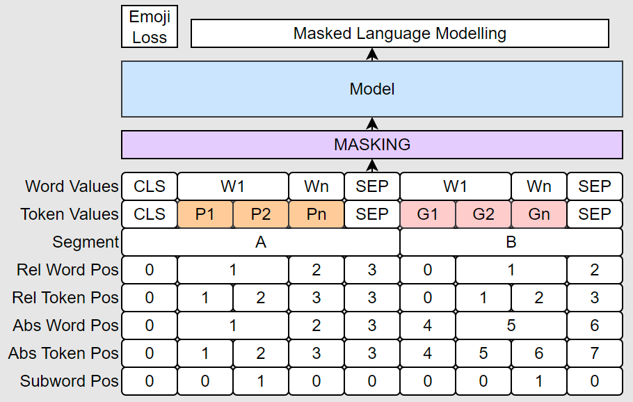

# pngnw_bert

Unofficial PyTorch implementation of [PnG BERT](https://arxiv.org/pdf/2103.15060.pdf) with some changes.

Dubbed "Phoneme and Grapheme and Word BERT", this model includes additional word-level embeddings on both grapheme and phoneme side of the model.

Also does (or will) include additional text-to-emoji objective using DeepMoji teacher model.

---

Here's the modified architecture.

New stuff is

- Word Values Embeddings

- Rel Word and Rel Token Position Embeddings

- Subword Position Embeddings

- Emoji Teacher Loss

The position embeddings are configurable in the config and I will likely disable some of them once I find the best configuration for training.
